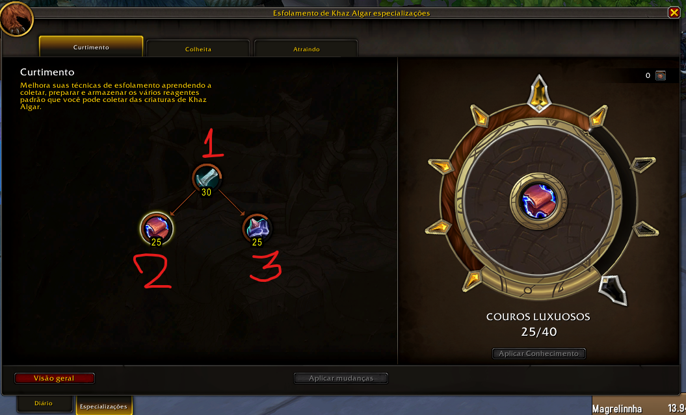
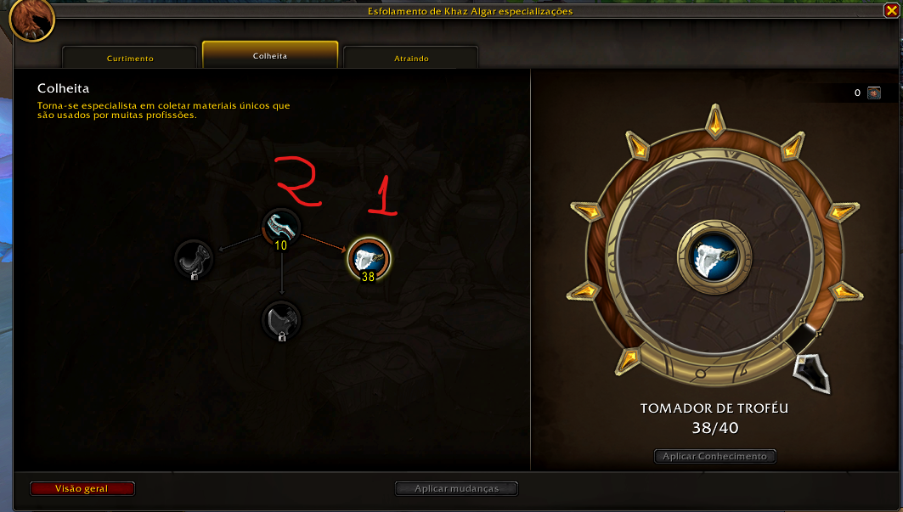

# Guia de Especialização de Esfolamento – The War Within (WoW)

Este guia visual mostra a ordem recomendada para o aprimoramento das habilidades dentro da profissão **Esfolamento**, com foco em eficiência e progressão rápida.

---

## 📈 Ordem de Up das Skills – Especializações de Esfolamento

A imagem abaixo mostra a ordem ideal para distribuir os pontos nas diferentes especializações de **Esfolamento**:

---

## 🌿 Especialização: Colheita

Abaixo, a imagem mostra uma visualização da especialização **Colheita**, útil para otimizar a coleta de materiais raros durante o esfolamento:

O node a direita é o mais importante, então será necessário liberar o primeiro node apenas para liberar o node a direita.

---

> 💡 Dica: Lembre-se de visitar os treinadores e usar os pontos com sabedoria. Alguns caminhos dão bônus específicos para farmar reagentes ou aumentar sua eficiência com criaturas de tipos específicos.
